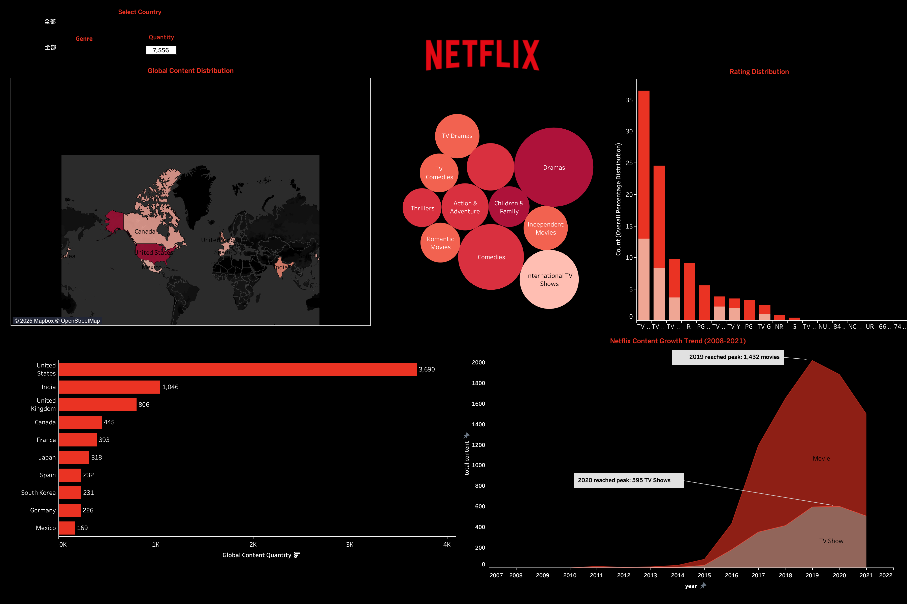

# Netflix-Data-Analysis-SQL-Tableau-

**Project Objective**  
This project aims to analyze Netflix data using SQL queries written in PostgreSQL and visualize key insights with Tableau. The analysis explores content growth trends, genre distribution, rating breakdowns, and global content sources. It serves as a data analytics portfolio demonstration.

---

## Dataset Source
- **Dataset Name:** Netflix Movies and TV Shows (Kaggle)  
- **Total Records:** 8,807 entries  
- **Date Range:** Content added between 2008 and 2021  
- **Key Fields:** title, type, director, cast, country, release_year, date_added, rating, duration, listed_in, description

---

## Technologies Used
- **PostgreSQL 15** – SQL queries and data processing  
- **Tableau Desktop** – Interactive data visualizations

---

## 📊 Analysis Topics & Summary of Results

### 1. Netflix Content Growth Trend
- **Query Logic:** Count of new content per year by type (Movie / TV Show)  
- **Summary:** Sharp increase in added content since 2011, with notable growth in TV Shows  
- **Business Insight:** Indicates Netflix’s strategy to expand TV series offerings to boost watch time and viewer retention

### 2. Global Content Origin Distribution
- **Query Logic:** Split multi-country values in the `country` field and count occurrences  
- **Summary:** Top 3 countries: USA, India, UK  
- **Business Insight:** Content primarily originates from English-speaking markets

### 3. Genre Distribution Analysis
- **Query Logic:** Parse `listed_in` column and count the frequency of each genre  
- 🔍 **Summary:** Top genres are Drama, International Movies, and Comedy  
- 💡 **Business Insight:** Audiences prefer dramatic and international content; strategies can focus on strengthening top genres and improving recommendation systems

### 4. Rating Distribution Analysis
- **Query Logic:** Count content by type and rating level  
- **Summary:** TV-MA is the most frequent rating, indicating high proportion of mature content  
- **Business Insight:** Content strategy targets mature audiences, with supplementary offerings for families (TV-14 / PG-13)

---

## SQL Query Code

[View SQL Queries](./sql/visulization_query.sql)

Each SQL snippet corresponds to a specific Tableau chart. Example:
```sql
-- Annual Content Growth Trend
SELECT EXTRACT(YEAR FROM TO_DATE(date_added, 'Month DD, YYYY')) AS year,
       types,
       COUNT(*)
FROM netflix
GROUP BY 1, 2
ORDER BY 1, 2;
```

---

## Tableau Dashboard

[👉 View Tableau Dashboard (Interactive Visualization)]
(https://public.tableau.com/app/profile/chu.pei.hsin/viz/netflix_project_17443086344970/2#1)  
<br>




---

## Project Structure
```
netflix-sql-project/
├── data/
│   └── netflix_titles.csv                  # Raw dataset
├── sql/
│   └── visualization_query.sql             # All SQL query scripts
├── images/
│   └── netflix_analysis_visulization.png   # Tableau visualization screenshot
├── README.md                               # Project documentation
```

